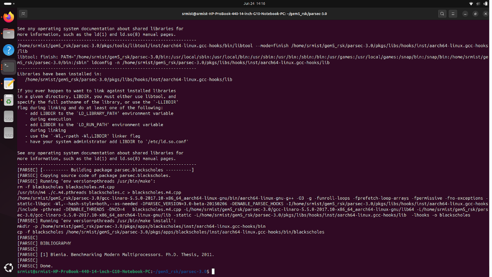
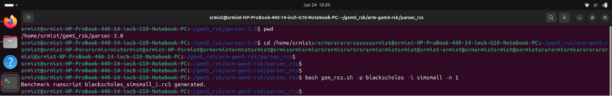
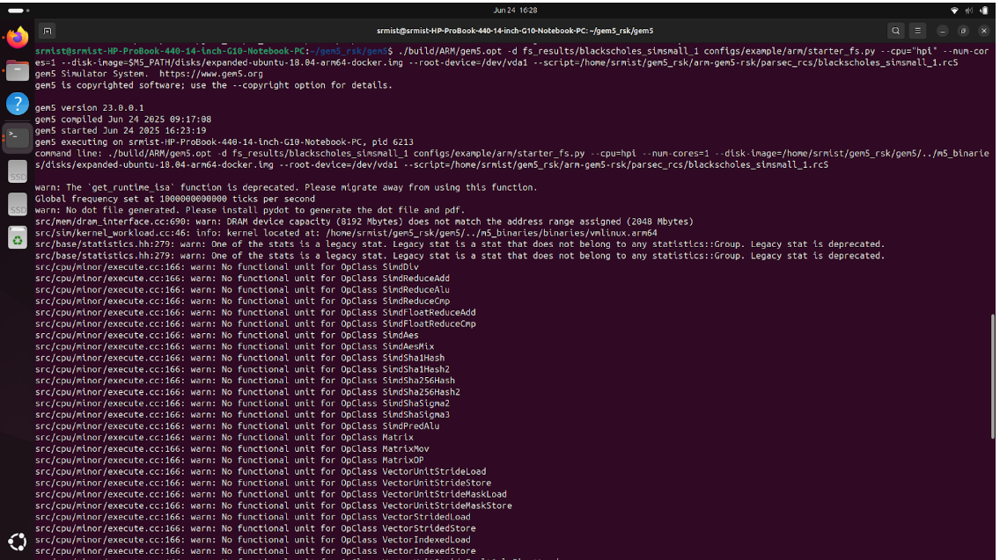
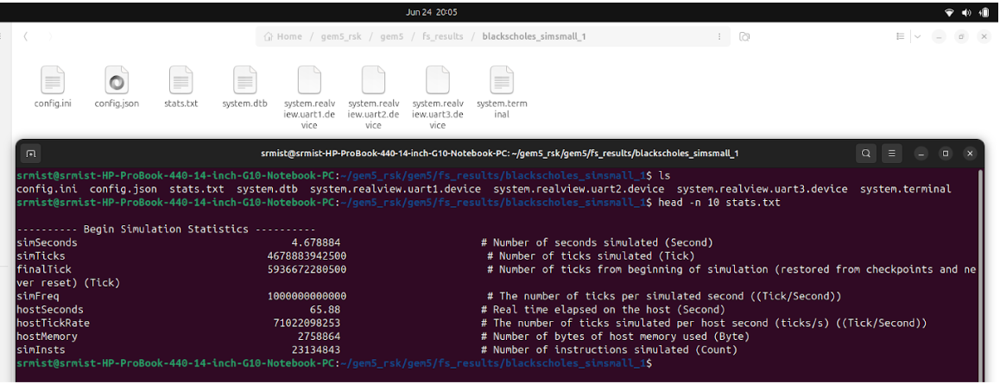

# 🚀 gem5 + PARSEC 3.0 ARM Integration

This repository contains simulation setup and benchmarking of **gem5 ARM** architecture with **PARSEC 3.0 benchmarks** including power model integration.

## ⚙️ Step 1: Build gem5 (ARM)

git clone https://gem5.googlesource.com/public/gem5

cd gem5

scons build/ARM/gem5.opt -j$(nproc)

## ⚙️ Step 2: Build PARSEC Benchmarks for ARM

cd ~/gem5_srm/parsec-3.0

source env.sh

parsecmgmt -a build -p blackscholes -c gcc-hooks

Repeat this step for:

ferret

freqmine

facesim

fluidanimate

swaptions

## ⚙️Step 3: Generate rcS Script

cd arm-gem5-rsk/parsec_rcs

bash gen_rcs.sh -p blackscholes -i simsmall -n 1

This generates:
blackscholes_simsmall_1.rcS

## ⚙️ Step 4: Run Full-System Simulation

cd gem5

./build/ARM/gem5.opt -d fs_results/blackscholes_simsmall_1 \
configs/example/arm/starter_fs.py \
--cpu="hpi" --num-cores=1 \
--disk-image=$M5_PATH/disks/expanded-ubuntu-18.04-arm64-docker.img \
--root-device=/dev/vda1 \
--script=arm-gem5-rsk/parsec_rcs/blackscholes_simsmall_1.rcS

## ⚙️ Step 5: Validate Output

cd fs_results/blackscholes_simsmall_1

# Check m5out, output logs, and stats.txt

