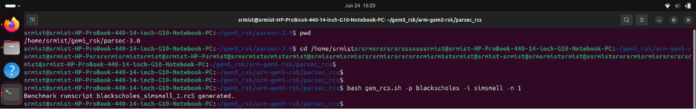
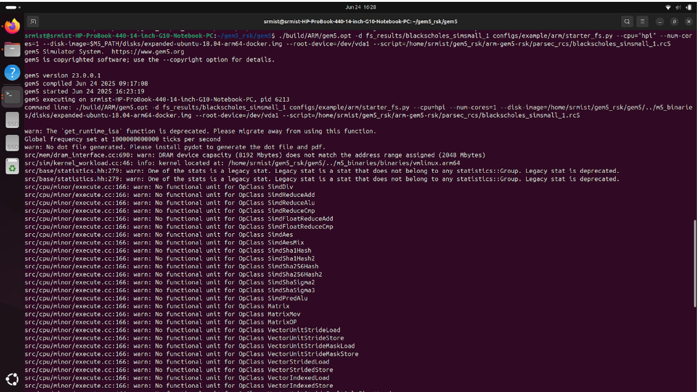
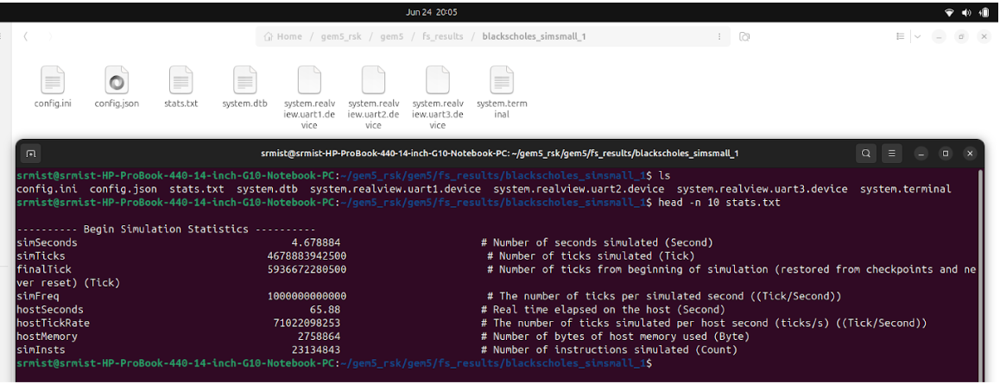

# 🚀 Full-System Simulation of PARSEC Benchmarks on ARM using gem5

This repository provides the environment, scripts, and setup needed to run **PARSEC 3.0 benchmarks** on an **ARM full-system simulator** using `gem5`. It also includes a **real-time power model integration** via socket communication.

---

## 📁 Repository Structure

gem5_srm/
├── gem5/ # gem5 source code (ARM build)
├── parsec-3.0/ # PARSEC 3.0 benchmark suite
├── m5_binaries/ # Kernel and disk images (not pushed to GitHub due to size limits)
├── power_model/ # Power model with regression scripts and server
├── power_socket/ # Socket communication implementation
├── shared_directory/ # Shared host-to-guest directory
└── clone.sh # Setup helper script


---

## ⚙️ Step 1: Build gem5 (ARM)

```bash
git clone https://gem5.googlesource.com/public/gem5
cd gem5
scons build/ARM/gem5.opt -j$(nproc)

---

## ⚙️ Step 2: Build PARSEC Benchmarks for ARM

```bash
cd ~/gem5_srm/parsec-3.0
source env.sh
parsecmgmt -a build -p blackscholes -c gcc-hooks


Repeat this step for:

ferret

freqmine

facesim

fluidanimate

swaptions


---

## ⚙️Step 3: Generate rcS Script

```bash
cd arm-gem5-rsk/parsec_rcs
bash gen_rcs.sh -p blackscholes -i simsmall -n 1

This generates:
blackscholes_simsmall_1.rcS




---

## ⚙️ Step 4: Run Full-System Simulation

```bash
cd gem5
./build/ARM/gem5.opt -d fs_results/blackscholes_simsmall_1 \
configs/example/arm/starter_fs.py \
--cpu="hpi" --num-cores=1 \
--disk-image=$M5_PATH/disks/expanded-ubuntu-18.04-arm64-docker.img \
--root-device=/dev/vda1 \
--script=arm-gem5-rsk/parsec_rcs/blackscholes_simsmall_1.rcS




---

## ⚙️ Step 5: Validate Output

```bash
cd fs_results/blackscholes_simsmall_1
# Check m5out, output logs, and stats.txt




